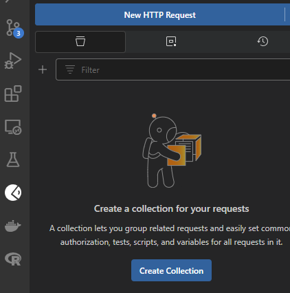
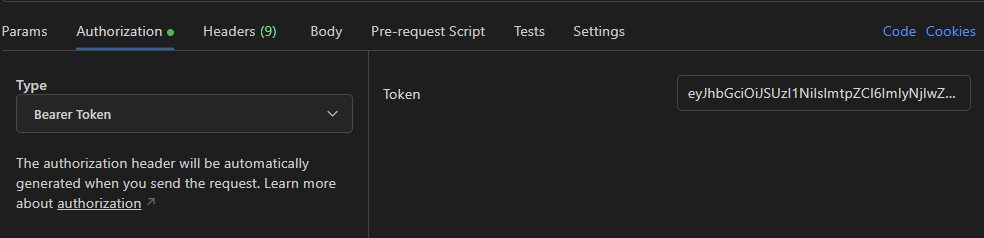
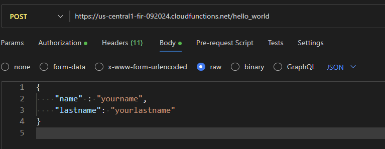
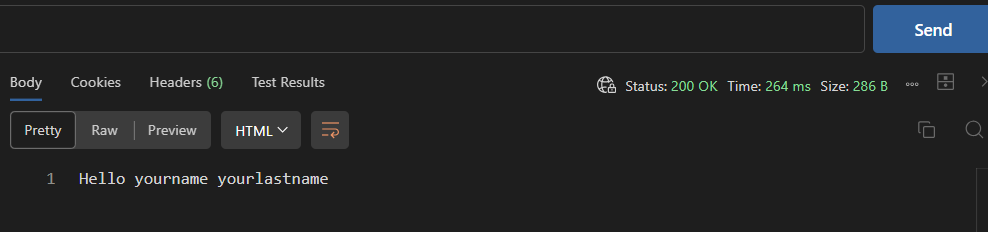

## Google Cloud functions - Authenticated

[GCloud functions](https://cloud.google.com/functions)

### Starting a project

To start a new project in Google Cloud, go to one of this links  
[Firebase console](https://console.firebase.google.com)  
[Projects console](https://console.cloud.google.com/cloud-resource-manager)

### Billing Account

At some point, gcloud will ask to associate the project to a billing account  
[Billing account](https://console.cloud.google.com/billing)

### Requirements

- [gcloud CLI](https://cloud.google.com/sdk/docs/install#deb)
- This was tested in Windows using WSL
- VSCode with WSL extension

### Workflow

```sh
# Log in
gcloud auth login --no-launch-browser

# Check accounts, "*" shows the active account
gcloud auth list

# Check project names and its IDs
gcloud projects list

# activate project
gcloud config set project [project-id]
gcloud config set project fir-092024 # example
```

### Deploying app

#### Check List

- Contents of subfolder `hello_world`
  - `main.py` file
  - `requirements.txt` file

```sh
# enter folder, same as [app-name], same as the function name in main.py
cd [app-name]
cd hello_world

# deploy
gcloud functions deploy [app-name] --runtime=python312 --trigger-http --source=.
gcloud functions deploy hello_world --runtime=python312 --trigger-http --source=.

# You will see this prompt (select: N)
[p] Allow unauthenticated invocations of new function [hello_world]? (y/N)? N

# take note of the URL [app-URL] in the last line of the output
[o] url: https://[server-location]-[project-id].cloudfunctions.net/[app-name]
[o] url: https://us-central1-fir-092024.cloudfunctions.net/hello_world # example
```

### Make authenticated request

- Create Service Account

```sh
gcloud iam service-accounts create [service-account-name] --display-name="[Service Account Name]"
gcloud iam service-accounts create my-service-account-name --display-name="My Service Account" # example

# create .json key for the account
gcloud iam service-accounts keys create [json-key-path/filename] --iam-account=[service-account-name]@[project-id].iam.gserviceaccount.com
gcloud iam service-accounts keys create ~/service-account-key.json --iam-account=my-service-account-name@fir-092024.iam.gserviceaccount.com # example

# activate service account (1st time)
gcloud auth activate-service-account --key-file=[json-key-path/filename]
gcloud auth activate-service-account --key-file=$HOME/service-account-key.json # example

# create service account TOKEN,
# check [app-URL] above,
# service account being the active account
TOKEN=$(gcloud auth print-identity-token --audiences="[app-URL]")
TOKEN=$(gcloud auth print-identity-token --audiences="https://us-central1-fir-092024.cloudfunctions.net/hello_world") # example
```

- Add invoker role to the Service Account

```sh
# check accounts, you will see the service account and [main-account@email.com]
# active account has "*"
gcloud auth list

# add role to service account, but first activate main account
gcloud config set account [main-account@email.com]
gcloud config set account bob@gmail.com # example

# check that the served function does not use "_" but "-", [served-app-function]
gcloud run services list --format="value(metadata.name)" --region="[server-location]"
gcloud run services list --format="value(metadata.name)" --region="us-central1" # example

gcloud run services add-iam-policy-binding projects/[project-id]/locations/[server-location]/services/[served-app-function] \
  --region="[server-location]" \
  --member="serviceAccount:[service-account-name]@[project-id].iam.gserviceaccount.com" \
  --role="roles/run.invoker"

# example:
gcloud run services add-iam-policy-binding projects/fir-092024/locations/us-central1/services/hello-world \
  --region="us-central1" \
  --member="serviceAccount:my-service-account-name@fir-092024.iam.gserviceaccount.com" \
  --role="roles/run.invoker"

# check roles
gcloud run services get-iam-policy [served-app-function] --region="[server-location]"
gcloud run services get-iam-policy hello-world --region="us-central1" # example
```

### Request with `curl`

```sh
curl -H "Authorization: Bearer $TOKEN" [app-url]
curl -H "Authorization: Bearer $TOKEN" https://us-central1-fir-092024.cloudfunctions.net/hello_world # example

curl -H "Authorization: Bearer $TOKEN" \
  https://us-central1-fir-092024.cloudfunctions.net/hello_world\?name="yourname"\&lastname="yourlastname"

curl -H "Authorization: Bearer $TOKEN" \
  -X POST -H "Content-Type: application/json" -d '{"name": "value1", "lastname": "value2"}' \
  https://us-central1-fir-092024.cloudfunctions.net/hello_world
```

### Request using Postman

- Requirements
  - VSCode
  - Postman

```sh
sudo snap install postman

# - Install Postman extension in VSCode
```

- New HTTP Request



- Add token

```sh
echo $TOKEN
```



- Add .json



- Click send


